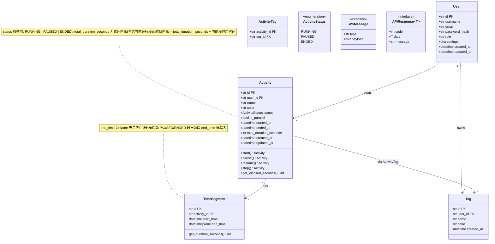
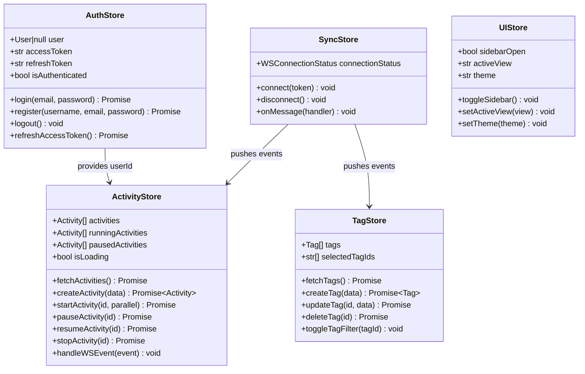
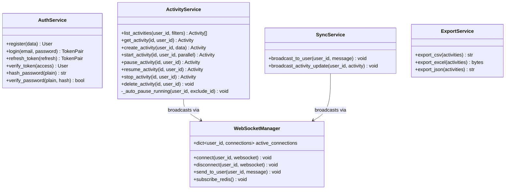
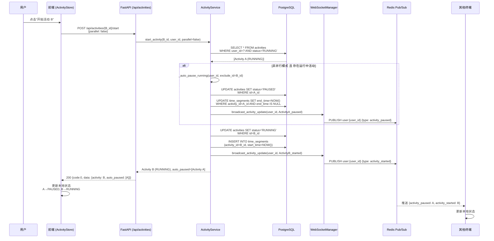
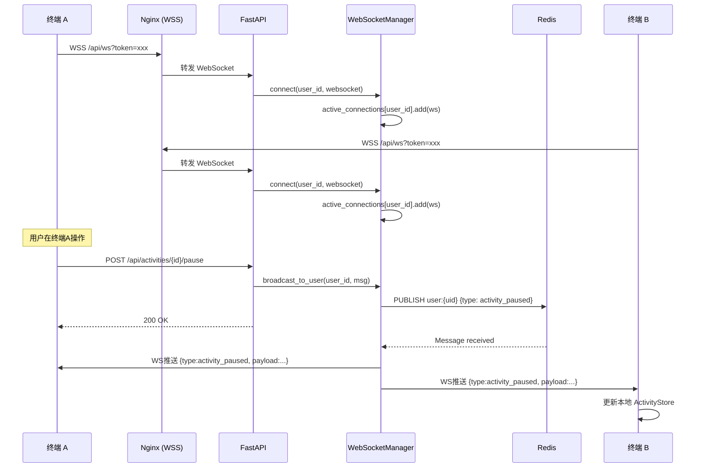
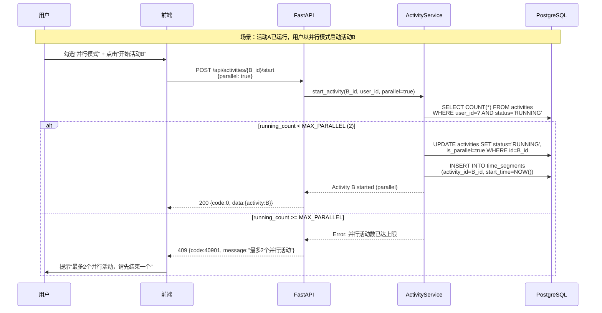
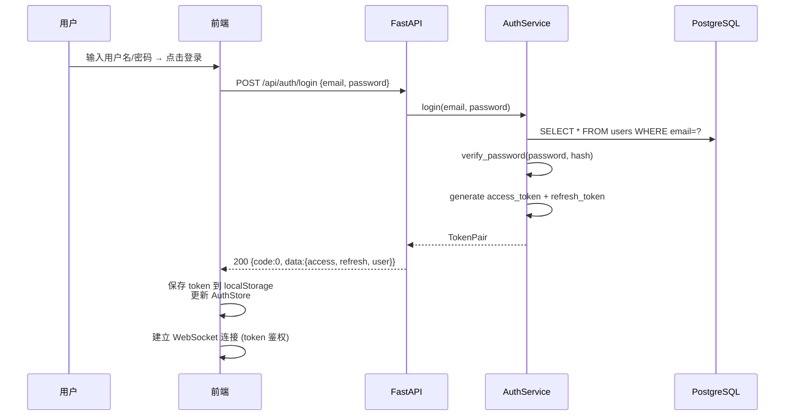
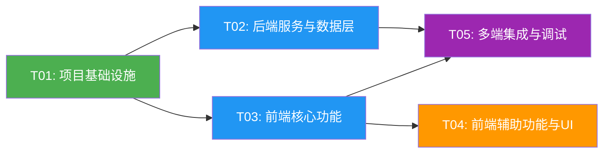

# Time Tracker 多终端活动时间追踪系统 — 系统架构设计

> **架构师**：高见远（Gao）  
> **日期**：2026-06-06  
> **版本**：v1.0  
> **基于**：PRD v1.0

---

## Part A：系统设计

### 1. 实现方案与框架选型

#### 1.1 核心技术挑战

| 挑战 | 难度 | 应对策略 |
|------|------|----------|
| 多终端实时数据同步（1-5s 延迟） | 🔴 高 | WebSocket 长连接 + Redis Pub/Sub 多进程广播，轮询兜底 |
| 自动暂停与并行模式的状态一致性 | 🔴 高 | 服务端统一处理自动暂停逻辑，避免客户端竞态 |
| 秒级计时器性能 | 🟡 中 | 前端 setInterval 1s 刷新 + 服务端 duration 校准 |
| Electron 悬浮窗与主窗口通信 | 🟡 中 | IPC 通道 + 共享 WebSocket 连接 |
| Monorepo 多端代码共享 | 🟡 中 | pnpm workspace + shared types/utils 包 |

#### 1.2 技术选型

| 层级 | 技术栈 | 选型理由 |
|------|--------|----------|
| **Web 前端** | Vite + React 18 + MUI 5 + Tailwind CSS | PRD 指定；Vite 极速 HMR，MUI 组件丰富，Tailwind 灵活定制 |
| **状态管理** | Zustand | 轻量、TypeScript 友好、支持订阅选择器，避免 Redux 样板代码 |
| **PC 客户端** | Electron 28+ | PRD 指定；成熟生态，支持 Always-on-top 悬浮窗、系统托盘 |
| **移动端** | Capacitor 5+ | PRD 建议；与 Web 共享全部 UI 代码，原生插件桥接摄像头/通知 |
| **后端** | Python 3.11 + FastAPI | PRD 默认 Python；FastAPI 原生 async/await + WebSocket + 自动 OpenAPI 文档 |
| **数据库** | PostgreSQL 16 | 生产级关系型数据库，JSONB 支持灵活 settings 字段 |
| **ORM** | SQLAlchemy 2.0 + Alembic | Python 生态主流 ORM，Alembic 数据库迁移 |
| **缓存/Pub-Sub** | Redis 7 | WebSocket 多进程消息广播 + Token 黑名单 + 速率限制 |
| **认证** | JWT（python-jose） | 无状态 Token 鉴权，access + refresh 双 Token 机制 |
| **实时通信** | FastAPI WebSocket + Redis Pub/Sub | WebSocket 优先，HTTP 轮询兜底；Redis 支持多 Worker 进程广播 |
| **数据导出** | openpyxl + csv 标准库 | Excel/CSV/JSON 三格式导出 |
| **部署** | Docker Compose + Nginx | 容器化部署，Nginx 反向代理 + TLS 终止 + 静态资源托管 |

#### 1.3 架构模式

- **前端**：组件化 + 状态驱动（Zustand Store → React Component），单向数据流
- **后端**：分层架构（Router → Service → Model），依赖注入（FastAPI Depends）
- **通信**：REST API（数据 CRUD） + WebSocket（实时状态推送），双协议互补

#### 1.4 整体架构图

```
┌──────────────────────────────────────────────────────────────────┐
│                        客户端层                                    │
│  ┌──────────┐  ┌──────────────┐  ┌────────────────┐              │
│  │ Web App  │  │ Electron App │  │ Capacitor App  │              │
│  │ (React)  │  │ (React+Shell)│  │ (React+Native) │              │
│  └────┬─────┘  └──────┬───────┘  └───────┬────────┘              │
│       │               │                  │                        │
│       └───────────────┼──────────────────┘                        │
│                       │ HTTP/HTTPS + WSS                          │
└───────────────────────┼──────────────────────────────────────────┘
                        │
┌───────────────────────┼──────────────────────────────────────────┐
│                  Nginx (反向代理 + TLS)                            │
│              /api/* → FastAPI    /* → 静态资源                     │
└───────────────────────┼──────────────────────────────────────────┘
                        │
┌───────────────────────┼──────────────────────────────────────────┐
│                     服务端层                                       │
│  ┌────────────────────────────────────────┐                      │
│  │         FastAPI Application             │                      │
│  │  ┌──────────┐  ┌───────────────────┐   │                      │
│  │  │ REST API │  │ WebSocket Server  │   │                      │
│  │  │ (Router) │  │ (Connection Mgr)  │   │                      │
│  │  └────┬─────┘  └────────┬──────────┘   │                      │
│  │       │                  │              │                      │
│  │  ┌────┴──────────────────┴────────┐     │                      │
│  │  │         Service Layer          │     │                      │
│  │  └──────────────┬────────────────┘     │                      │
│  └─────────────────┼──────────────────────┘                      │
│                    │                                               │
│       ┌────────────┴────────────┐                                  │
│       │                         │                                  │
│  ┌────┴─────┐           ┌───────┴──────┐                           │
│  │PostgreSQL│           │    Redis     │                           │
│  │(数据存储) │           │(Pub/Sub+缓存)│                           │
│  └──────────┘           └──────────────┘                           │
└──────────────────────────────────────────────────────────────────┘
```

---

### 2. 文件列表

采用 **pnpm monorepo** 结构，共享 `packages/shared` 包：

```
time_tracker/
│
├── package.json                              # 根 workspace 配置
├── pnpm-workspace.yaml                       # pnpm workspace 定义
├── tsconfig.base.json                        # 共享 TypeScript 基础配置
├── .gitignore
├── .env.example                              # 环境变量模板
├── docker-compose.yml                        # 容器编排
├── Dockerfile.server                         # 后端镜像
├── nginx.conf                                # Nginx 反向代理配置
│
├── packages/
│   └── shared/                               # 共享类型与工具
│       ├── package.json
│       ├── tsconfig.json
│       └── src/
│           ├── index.ts                      # 统一导出
│           ├── types/
│           │   ├── activity.ts               # Activity / TimeSegment 类型
│           │   ├── user.ts                   # User / Auth 类型
│           │   ├── tag.ts                    # Tag 类型
│           │   └── api.ts                    # API 响应 / WS 消息类型
│           ├── constants/
│           │   └── index.ts                   # 状态枚举 / 并行上限等常量
│           └── utils/
│               ├── time.ts                   # 时间格式化 / 时长计算
│               └── format.ts                 # 通用格式化工具
│
├── apps/
│   ├── web/                                  # Web 前端（Vite + React）
│   │   ├── package.json
│   │   ├── vite.config.ts
│   │   ├── tsconfig.json
│   │   ├── tailwind.config.ts
│   │   ├── postcss.config.js
│   │   ├── index.html
│   │   └── src/
│   │       ├── main.tsx                      # React 入口
│   │       ├── App.tsx                       # 根组件
│   │       ├── vite-env.d.ts
│   │       ├── api/                          # API 请求层
│   │       │   ├── client.ts                 # Axios 实例 + 拦截器
│   │       │   ├── auth.ts                   # 认证 API
│   │       │   ├── activities.ts             # 活动 API
│   │       │   ├── tags.ts                   # 标签 API
│   │       │   └── stats.ts                  # 统计 / 导出 API
│   │       ├── stores/                       # Zustand 状态管理
│   │       │   ├── authStore.ts              # 认证状态
│   │       │   ├── activityStore.ts           # 活动状态 + 计时逻辑
│   │       │   ├── tagStore.ts               # 标签状态
│   │       │   ├── syncStore.ts              # WebSocket 同步状态
│   │       │   └── uiStore.ts                # UI 状态（侧边栏 / 主题等）
│   │       ├── hooks/                        # 自定义 Hooks
│   │       │   ├── useTimer.ts               # 秒级计时器 Hook
│   │       │   ├── useWebSocket.ts            # WebSocket 连接管理
│   │       │   └── useActivity.ts             # 活动操作组合 Hook
│   │       ├── components/                   # UI 组件
│   │       │   ├── layout/
│   │       │   │   ├── AppLayout.tsx          # 主布局（Header+Sidebar+Content）
│   │       │   │   ├── Header.tsx             # 顶部导航
│   │       │   │   └── Sidebar.tsx            # 侧边栏导航 + 标签筛选
│   │       │   ├── activity/
│   │       │   │   ├── ActivityCard.tsx       # 活动卡片（计时+操作）
│   │       │   │   ├── ActivityForm.tsx       # 活动 创建/编辑 表单
│   │       │   │   ├── ActivityList.tsx       # 活动列表
│   │       │   │   └── TimerDisplay.tsx       # 计时器显示组件
│   │       │   ├── timeline/
│   │       │   │   └── Timeline.tsx           # 时间轴视图（P1）
│   │       │   ├── stats/
│   │       │   │   └── StatsPanel.tsx          # 统计面板（P1）
│   │       │   ├── tags/
│   │       │   │   ├── TagManager.tsx          # 标签管理（P1）
│   │       │   │   └── TagFilter.tsx           # 标签筛选
│   │       │   ├── auth/
│   │       │   │   ├── LoginPage.tsx           # 登录页
│   │       │   │   └── RegisterPage.tsx        # 注册页
│   │       │   └── common/
│   │       │       ├── ConfirmDialog.tsx       # 确认弹窗
│   │       │       └── LoadingSpinner.tsx       # 加载指示器
│   │       ├── pages/                        # 页面组件
│   │       │   ├── HomePage.tsx               # 主面板
│   │       │   ├── TimelinePage.tsx            # 时间轴页（P1）
│   │       │   ├── StatsPage.tsx               # 统计页（P1）
│   │       │   ├── TagsPage.tsx                # 标签管理页（P1）
│   │       │   └── SettingsPage.tsx            # 设置页
│   │       ├── router/
│   │       │   └── index.tsx                  # React Router 路由配置
│   │       ├── services/                     # 业务服务
│   │       │   ├── timerService.ts            # 计时器核心逻辑
│   │       │   ├── syncService.ts             # 数据同步逻辑
│   │       │   └── exportService.ts            # 数据导出（P1）
│   │       ├── theme/
│   │       │   └── theme.ts                   # MUI 主题配置
│   │       └── styles/
│   │           └── globals.css                # Tailwind 全局样式
│   │
│   ├── electron/                             # Electron PC 客户端
│   │   ├── package.json
│   │   ├── tsconfig.json
│   │   ├── main.ts                           # Electron 主进程
│   │   ├── preload.ts                        # 预加载脚本
│   │   └── floating-window/
│   │       ├── floatingWindow.html            # 悬浮窗页面
│   │       ├── floatingWindow.ts              # 悬浮窗逻辑
│   │       └── floatingWindow.css              # 悬浮窗样式
│   │
│   └── mobile/                               # Capacitor 移动端
│       ├── package.json
│       ├── capacitor.config.ts
│       ├── tsconfig.json
│       ├── android/                           # Android 平台（Capacitor 生成）
│       └── ios/                               # iOS 平台（Capacitor 生成）
│
├── server/                                   # Python 后端
│   ├── requirements.txt
│   ├── pyproject.toml
│   ├── alembic.ini
│   ├── Dockerfile
│   ├── app/
│   │   ├── __init__.py
│   │   ├── main.py                           # FastAPI 应用入口
│   │   ├── config.py                         # 配置管理
│   │   ├── database.py                       # 数据库连接 / Session
│   │   ├── dependencies.py                   # 依赖注入（get_db, get_current_user）
│   │   ├── models/                           # SQLAlchemy 模型
│   │   │   ├── __init__.py
│   │   │   ├── user.py
│   │   │   ├── activity.py
│   │   │   ├── tag.py
│   │   │   └── time_segment.py
│   │   ├── schemas/                          # Pydantic Schema
│   │   │   ├── __init__.py
│   │   │   ├── user.py
│   │   │   ├── activity.py
│   │   │   ├── tag.py
│   │   │   └── ws.py
│   │   ├── routers/                          # API 路由
│   │   │   ├── __init__.py
│   │   │   ├── auth.py
│   │   │   ├── activities.py
│   │   │   ├── tags.py
│   │   │   ├── stats.py
│   │   │   └── admin.py
│   │   ├── services/                         # 业务逻辑
│   │   │   ├── __init__.py
│   │   │   ├── auth_service.py
│   │   │   ├── activity_service.py
│   │   │   ├── sync_service.py
│   │   │   └── export_service.py
│   │   └── ws/                               # WebSocket
│   │       ├── __init__.py
│   │       └── manager.py                     # 连接管理 + Redis Pub/Sub
│   └── migrations/                            # Alembic 迁移
│       ├── env.py
│       └── versions/
│
└── docs/
    ├── PRD.md
    ├── ARCHITECTURE.md
    ├── sequence-diagram.mermaid
    └── class-diagram.mermaid
```

---

### 3. 数据结构与接口（类图）



#### 前端 Store 类图



#### 后端 Service 类图



---

### 4. 程序调用流程（时序图）

#### 4.1 活动开始（含自动暂停）



#### 4.2 WebSocket 实时同步



#### 4.3 并行模式活动启动



#### 4.4 用户认证流程



---

### 5. 待明确事项

| 编号 | 问题 | 当前假设 | 影响 |
|------|------|----------|------|
| A-1 | 并行上限是否固定为 2？ | MVP 固定 2，代码中用 `MAX_PARALLEL` 常量，预留可配置 | ActivityService._auto_pause_running |
| A-2 | 自动暂停是否可关闭？ | 默认开启，`User.settings.auto_pause_enabled` 字段预留 | ActivityService.start_activity |
| A-3 | 离线数据同步冲突策略 | 采用 Last Write Wins（LWW） | syncService |
| A-4 | 管理员权限边界 | MVP 仅支持数据备份/恢复，P2 细化 | admin router |
| A-5 | 数据保留策略实现方式 | 定时任务 + 用户手动确认删除 | 需要 Celery 或 APScheduler |
| A-6 | 悬浮窗是否需要独立于主窗口运行 | 是，悬浮窗为独立 BrowserWindow，共享 IPC | Electron main.ts |
| A-7 | 移动端推送通知实现方式 | P2 阶段，Capacitor Push Notification 插件 | 移动端 |
| A-8 | 数据库字符集与排序规则 | PostgreSQL UTF-8，默认排序 | database.py |

---

## Part B：任务分解

### 6. 依赖包列表

#### 6.1 前端（apps/web）

```
- react@^18.2.0: UI 框架
- react-dom@^18.2.0: DOM 渲染
- react-router-dom@^6.20.0: 路由
- @mui/material@^5.14.0: 组件库
- @mui/icons-material@^5.14.0: 图标
- @emotion/react@^11.11.0: MUI 样式引擎
- @emotion/styled@^11.11.0: MUI 样式引擎
- @tanstack/react-query@^5.10.0: 服务端状态管理
- zustand@^4.4.0: 客户端状态管理
- axios@^1.6.0: HTTP 请求
- dayjs@^1.11.0: 日期处理
- recharts@^2.10.0: 图表库（统计页）
- file-saver@^2.0.5: 文件下载
- vite@^5.0.0: 构建工具
- typescript@^5.3.0: 类型检查
- tailwindcss@^3.4.0: 原子化 CSS
- postcss@^8.4.0: CSS 处理
- autoprefixer@^10.4.0: CSS 前缀
- @vitejs/plugin-react@^4.2.0: Vite React 插件
```

#### 6.2 Electron（apps/electron）

```
- electron@^28.0.0: 桌面应用框架
- electron-builder@^24.9.0: 打包工具
```

#### 6.3 移动端（apps/mobile）

```
- @capacitor/core@^5.6.0: Capacitor 核心
- @capacitor/cli@^5.6.0: Capacitor CLI
- @capacitor/app@^5.0.0: App 插件
- @capacitor/push-notifications@^5.0.0: 推送通知（P2）
```

#### 6.4 共享包（packages/shared）

```
- typescript@^5.3.0: 类型定义
```

#### 6.5 后端（server/）

```
- fastapi@^0.104.0: Web 框架
- uvicorn[standard]@^0.24.0: ASGI 服务器
- sqlalchemy@^2.0.0: ORM
- alembic@^1.12.0: 数据库迁移
- asyncpg@^0.29.0: PostgreSQL 异步驱动
- python-jose[cryptography]@^3.3.0: JWT
- passlib[bcrypt]@^1.7.0: 密码哈希
- pydantic@^2.5.0: 数据验证
- redis@^5.0.0: Redis 客户端
- python-multipart@^0.0.6: 文件上传
- openpyxl@^3.1.0: Excel 导出
- python-dotenv@^1.0.0: 环境变量
- httpx@^0.25.0: HTTP 客户端（测试用）
- psycopg2-binary@^2.9.0: PostgreSQL 同步驱动（Alembic）
```

#### 6.6 开发 & 部署

```
- docker@^24.0: 容器化
- docker-compose@^2.23: 容器编排
- nginx@^1.25: 反向代理
- postgresql@^16: 数据库
- redis@^7: 缓存/Pub-Sub
```

---

### 7. 任务列表

| Task ID | 任务名称 | 涉及文件 | 依赖 | 优先级 |
|---------|---------|---------|------|--------|
| T01 | 项目基础设施 | 根配置 + 入口文件 + 依赖声明（详见下方） | 无 | P0 |
| T02 | 后端服务与数据层 | 数据模型 + REST API + WebSocket + 认证 | T01 | P0 |
| T03 | 前端核心功能 | 活动管理 + 计时器 + 自动暂停 + 状态管理 + 认证 | T01 | P0 |
| T04 | 前端辅助功能与 UI | 时间轴 + 统计 + 标签 + 导出 + 页面 + 主题 | T03 | P1 |
| T05 | 多端集成与调试 | 路由 + Electron 悬浮窗 + Capacitor + 集成测试 | T03, T02 | P0-P1 |

#### T01: 项目基础设施

**描述**：搭建 monorepo 项目骨架，包含所有配置文件、入口文件和依赖声明。确保前后端均能启动空壳应用。

**涉及文件**（≥3）：

| 模块 | 文件 |
|------|------|
| 根配置 | `package.json`, `pnpm-workspace.yaml`, `tsconfig.base.json`, `.gitignore`, `.env.example`, `docker-compose.yml`, `Dockerfile.server`, `nginx.conf` |
| 共享包 | `packages/shared/package.json`, `packages/shared/tsconfig.json`, `packages/shared/src/index.ts`, `packages/shared/src/types/activity.ts`, `packages/shared/src/types/user.ts`, `packages/shared/src/types/tag.ts`, `packages/shared/src/types/api.ts`, `packages/shared/src/constants/index.ts`, `packages/shared/src/utils/time.ts`, `packages/shared/src/utils/format.ts` |
| Web 前端入口 | `apps/web/package.json`, `apps/web/vite.config.ts`, `apps/web/tsconfig.json`, `apps/web/tailwind.config.ts`, `apps/web/postcss.config.js`, `apps/web/index.html`, `apps/web/src/main.tsx`, `apps/web/src/App.tsx`, `apps/web/src/vite-env.d.ts`, `apps/web/src/styles/globals.css`, `apps/web/src/theme/theme.ts` |
| Electron 入口 | `apps/electron/package.json`, `apps/electron/tsconfig.json`, `apps/electron/main.ts`, `apps/electron/preload.ts` |
| 移动端入口 | `apps/mobile/package.json`, `apps/mobile/capacitor.config.ts`, `apps/mobile/tsconfig.json` |
| 后端入口 | `server/requirements.txt`, `server/pyproject.toml`, `server/alembic.ini`, `server/app/__init__.py`, `server/app/main.py`, `server/app/config.py`, `server/app/database.py`, `server/app/dependencies.py` |

**验收标准**：
- `pnpm install` 无报错
- `cd apps/web && pnpm dev` 能启动空壳 React 页面
- `cd server && uvicorn app.main:app --reload` 能启动空壳 FastAPI
- `docker-compose up` 能启动 PostgreSQL + Redis 容器

---

#### T02: 后端服务与数据层

**描述**：实现完整的后端服务，包括数据库模型、RESTful API、WebSocket 实时推送、JWT 认证、自动暂停逻辑和数据导出。

**涉及文件**（≥3）：

| 模块 | 文件 |
|------|------|
| 数据模型 | `server/app/models/__init__.py`, `server/app/models/user.py`, `server/app/models/activity.py`, `server/app/models/tag.py`, `server/app/models/time_segment.py` |
| Pydantic Schema | `server/app/schemas/__init__.py`, `server/app/schemas/user.py`, `server/app/schemas/activity.py`, `server/app/schemas/tag.py`, `server/app/schemas/ws.py` |
| API 路由 | `server/app/routers/__init__.py`, `server/app/routers/auth.py`, `server/app/routers/activities.py`, `server/app/routers/tags.py`, `server/app/routers/stats.py`, `server/app/routers/admin.py` |
| 业务逻辑 | `server/app/services/__init__.py`, `server/app/services/auth_service.py`, `server/app/services/activity_service.py`, `server/app/services/sync_service.py`, `server/app/services/export_service.py` |
| WebSocket | `server/app/ws/__init__.py`, `server/app/ws/manager.py` |
| 数据库迁移 | `server/migrations/env.py`, `server/migrations/versions/` |

**验收标准**：
- 用户注册/登录 API 正常工作，返回 JWT Token
- 活动 CRUD + 开始/暂停/恢复/结束 API 正常工作
- 自动暂停逻辑：启动新活动时，已运行活动自动暂停
- 并行模式：最多 2 个并行活动，超出返回 409
- WebSocket 连接后，操作活动可在其他客户端实时收到推送
- 标签 CRUD API 正常
- 统计汇总 API 返回日/周/月数据
- 数据导出 API 返回 CSV/Excel/JSON

---

#### T03: 前端核心功能

**描述**：实现前端核心业务功能，包括活动管理、秒级计时器、自动暂停、并行模式、用户认证、WebSocket 同步、状态管理。

**涉及文件**（≥3）：

| 模块 | 文件 |
|------|------|
| API 请求层 | `apps/web/src/api/client.ts`, `apps/web/src/api/auth.ts`, `apps/web/src/api/activities.ts`, `apps/web/src/api/tags.ts`, `apps/web/src/api/stats.ts` |
| 状态管理 | `apps/web/src/stores/authStore.ts`, `apps/web/src/stores/activityStore.ts`, `apps/web/src/stores/tagStore.ts`, `apps/web/src/stores/syncStore.ts`, `apps/web/src/stores/uiStore.ts` |
| 自定义 Hooks | `apps/web/src/hooks/useTimer.ts`, `apps/web/src/hooks/useWebSocket.ts`, `apps/web/src/hooks/useActivity.ts` |
| 业务服务 | `apps/web/src/services/timerService.ts`, `apps/web/src/services/syncService.ts`, `apps/web/src/services/exportService.ts` |
| 布局组件 | `apps/web/src/components/layout/AppLayout.tsx`, `apps/web/src/components/layout/Header.tsx`, `apps/web/src/components/layout/Sidebar.tsx` |
| 活动组件 | `apps/web/src/components/activity/ActivityCard.tsx`, `apps/web/src/components/activity/ActivityForm.tsx`, `apps/web/src/components/activity/ActivityList.tsx`, `apps/web/src/components/activity/TimerDisplay.tsx` |
| 认证组件 | `apps/web/src/components/auth/LoginPage.tsx`, `apps/web/src/components/auth/RegisterPage.tsx` |
| 通用组件 | `apps/web/src/components/common/ConfirmDialog.tsx`, `apps/web/src/components/common/LoadingSpinner.tsx` |

**验收标准**：
- 用户可注册/登录，Token 持久化
- 创建活动 ≤ 3 步操作
- 一键开始/暂停/结束活动
- 秒级计时器显示，每秒刷新无卡顿
- 启动新活动时自动暂停当前活动
- 并行模式可启用，超过 2 个时显示冲突提示
- WebSocket 连接成功后，多终端操作实时同步
- 轮询兜底：WebSocket 断开时自动切换 HTTP 轮询

---

#### T04: 前端辅助功能与 UI

**描述**：实现 P1 级辅助功能，包括时间轴视图、统计汇总、标签管理、数据导出、标签筛选、页面组件和主题配置。

**涉及文件**（≥3）：

| 模块 | 文件 |
|------|------|
| 时间轴 | `apps/web/src/components/timeline/Timeline.tsx` |
| 统计 | `apps/web/src/components/stats/StatsPanel.tsx` |
| 标签 | `apps/web/src/components/tags/TagManager.tsx`, `apps/web/src/components/tags/TagFilter.tsx` |
| 页面 | `apps/web/src/pages/HomePage.tsx`, `apps/web/src/pages/TimelinePage.tsx`, `apps/web/src/pages/StatsPage.tsx`, `apps/web/src/pages/TagsPage.tsx`, `apps/web/src/pages/SettingsPage.tsx` |

**验收标准**：
- 时间轴日视图：活动块按时间排列
- 统计汇总：日/周/月切换，总时长 + 各活动占比图表
- 标签 CRUD：创建/编辑/删除标签，活动可关联多标签
- 标签筛选：侧边栏标签复选框筛选活动列表
- 数据导出：CSV / Excel / JSON 三种格式
- 主题：MUI 主题配置，Tailwind 样式完整

---

#### T05: 多端集成与调试

**描述**：完成路由配置、Electron PC 客户端封装（含悬浮窗）、Capacitor 移动端封装、端到端集成测试。

**涉及文件**（≥3）：

| 模块 | 文件 |
|------|------|
| 路由 | `apps/web/src/router/index.tsx` |
| Electron 悬浮窗 | `apps/electron/floating-window/floatingWindow.html`, `apps/electron/floating-window/floatingWindow.ts`, `apps/electron/floating-window/floatingWindow.css` |
| Electron 主进程 | `apps/electron/main.ts`, `apps/electron/preload.ts` |
| 移动端 | `apps/mobile/capacitor.config.ts` |
| 页面集成 | `apps/web/src/App.tsx`（路由集成最终版） |

**验收标准**：
- React Router 路由配置完整，所有页面可导航
- Electron 打包后主窗口正常加载 Web 应用
- Electron 悬浮窗 Always-on-Top，显示当前活动计时
- 悬浮窗透明度 20%-100% 可调
- Capacitor 移动端可在模拟器运行
- 移动端按钮尺寸 ≥ 44px
- 全端数据同步正常（Web ↔ PC ↔ Mobile）

---

### 8. 共享知识（跨文件约定）

```
# API 约定
- 所有 API 响应格式: {code: number, data: T, message: string}
  - code=0 表示成功，非0为错误码
  - 认证错误: code=40101, Token 过期: code=40102
  - 并行冲突: code=40901
- 分页参数: ?page=1&page_size=20
- 日期参数格式: ISO 8601 (YYYY-MM-DDTHH:mm:ss.sssZ)

# 认证约定
- JWT 双 Token 机制: accessToken (15min) + refreshToken (7d)
- Authorization Header: Bearer <accessToken>
- WebSocket 鉴权: 连接时 query 参数 ?token=<accessToken>

# 数据库约定
- 所有表主键: UUID (PostgreSQL gen_random_uuid())
- 所有时间字段: UTC 时区, TIMESTAMP WITH TIME ZONE
- 软删除: 不使用, 物理删除 + 数据保留策略 (P1)
- 用户隔离: 所有查询必须包含 user_id 条件

# WebSocket 消息格式
- 发送: {type: "activity_started"|"activity_paused"|"activity_stopped"|"activity_updated", payload: {...}}
- 心跳: 客户端每30s发送 {type: "ping"}, 服务端响应 {type: "pong"}
- 重连: 指数退避 (1s, 2s, 4s, 8s, 最大30s)

# 前端约定
- 状态管理: Zustand (客户端状态) + React Query (服务端缓存)
- 组件命名: PascalCase 文件名 = 组件名
- 样式方案: MUI sx prop 为主, Tailwind classnames 为辅
- API 请求: 统一通过 src/api/client.ts Axios 实例
- 环境变量: VITE_API_BASE_URL, VITE_WS_BASE_URL

# 目录约定
- 前端组件: src/components/{模块名}/PascalCase.tsx
- 后端路由: app/routers/{资源名}.py
- 后端服务: app/services/{服务名}_service.py
- 共享类型: packages/shared/src/types/{资源名}.ts
```

---

### 9. 任务依赖图



**说明**：
- T01（绿色）为基础层，所有任务依赖它
- T02/T03（蓝色）为 P0 核心功能，可并行开发
- T04（橙色）为 P1 辅助功能，依赖 T03
- T05（紫色）为集成层，需要 T02+T03 完成后进行
