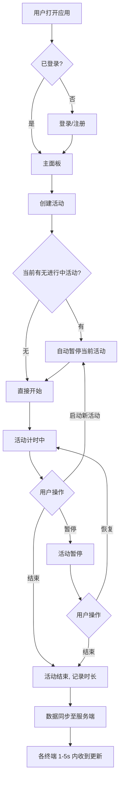
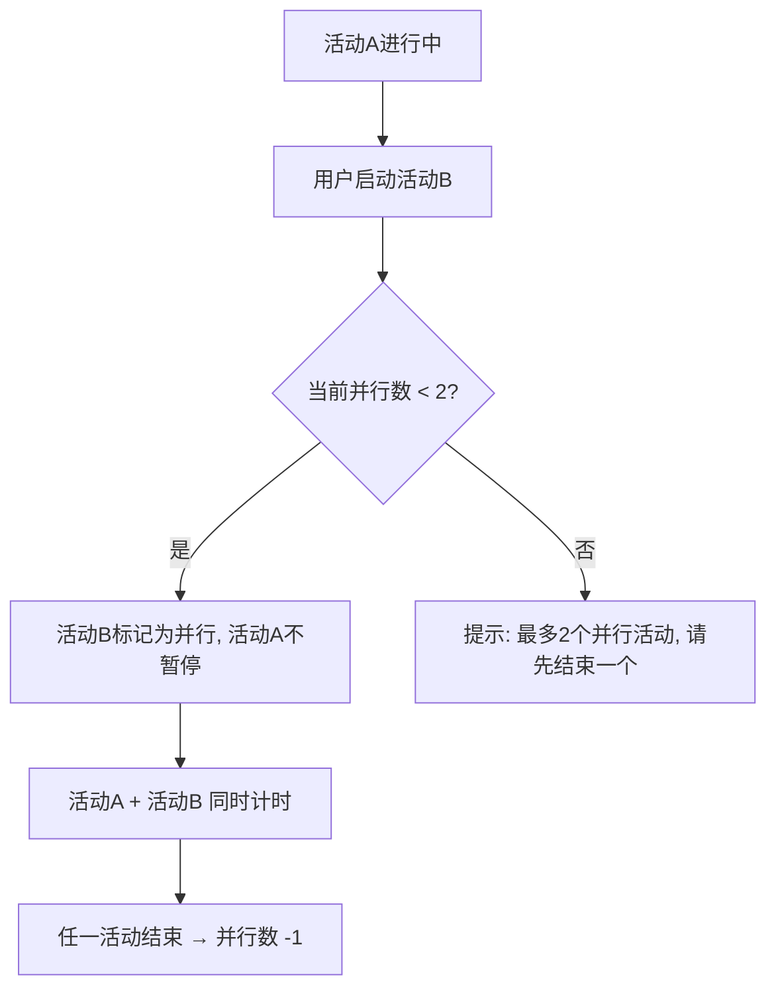

# Time Tracker 多终端活动时间追踪系统 — 产品需求文档（PRD）

## 项目信息

| 字段 | 内容 |
|------|------|
| Project Name | `time_tracker` |
| Language | 中文 |
| Web 技术栈 | Vite + React + MUI + Tailwind CSS |
| PC 客户端 | Electron 封装 |
| 移动端 | React Native / Capacitor |
| 原始需求 | 多终端活动时间追踪系统，支持公网部署与实时数据同步 |

---

## 产品定义

### 产品目标

1. **精准追踪**：提供零摩擦的活动计时体验，用户可一键开始/暂停/结束活动，系统自动处理活动冲突
2. **多端协同**：Web/PC/移动端数据实时同步，用户在任何终端操作后 1-5 秒内其余终端可见最新状态
3. **洞察驱动**：通过时间轴、统计汇总、标签分类帮助用户理解时间分配，支持数据导出进行深度分析

### 用户故事

| 编号 | 角色 | 用户故事 |
|------|------|----------|
| US-1 | 个人用户 | 作为一个自由职业者，我想快速创建活动并一键开始计时，以便低阻力地记录每项工作的时间投入 |
| US-2 | 个人用户 | 作为一个多任务工作者，我想同时运行两个活动（并行模式），以便准确记录如"边开会边写文档"的场景 |
| US-3 | 多设备用户 | 作为一个在电脑和手机间切换的用户，我想在一个终端开始活动后另一个终端立即看到最新状态，以便无缝衔接工作 |
| US-4 | PC 重度用户 | 作为一个需要频繁切换活动的用户，我想通过悬浮窗随时查看和操控活动计时，以便不打断当前工作流 |
| US-5 | 数据分析师 | 作为一个需要复盘时间分配的用户，我想按日/周/月查看统计汇总并导出数据，以便优化时间管理策略 |
| US-6 | 管理员 | 作为一个系统管理员，我想管理用户数据和执行备份，以便保障系统数据安全和合规 |

---

## 技术规范

### 需求池

#### P0 — 必须有（MVP）

| 编号 | 需求 | 描述 | 验收标准 |
|------|------|------|----------|
| P0-1 | 活动创建与计时 | 快速创建活动，一键开始/暂停/结束 | 创建活动 ≤ 3 步操作；计时精度秒级 |
| P0-2 | 自动暂停机制 | 启动新活动时自动暂停当前唯一活动 | 新活动开始后，原活动状态立即变为"已暂停" |
| P0-3 | 并行模式 | 支持最多 2 个活动同时运行 | 可手动将第 2 个活动标记为并行；超过 2 个时提示冲突 |
| P0-4 | 秒级刷新计时 | 进行中活动的计时显示每秒更新 | UI 计时器 1 秒刷新一次，无肉眼可见卡顿 |
| P0-5 | 用户认证 | 注册/登录，数据隔离 | 不同用户数据不可见；Token 鉴权 |
| P0-6 | 多终端数据同步 | Web/PC/移动端数据实时同步，延迟 1-5 秒 | 支持 HTTPS/WSS/HTTP；WebSocket 优先，轮询兜底 |
| P0-7 | 活动状态管理 | 活动状态：进行中 / 已暂停 / 已结束 | 状态变更实时反映到 UI，同步到各终端 |
| P0-8 | 服务端存储与 API | 后端数据存储 + RESTful API | 活动增删改查 API 完备；数据持久化 |
| P0-9 | 跨域安全与加密 | CORS 策略 + 数据传输加密（TLS/WSS） | 生产环境强制 HTTPS/WSS；CORS 白名单 |

#### P1 — 应该有

| 编号 | 需求 | 描述 | 验收标准 |
|------|------|------|----------|
| P1-1 | 活动历史时间轴 | 按时间轴视图展示历史活动 | 支持日视图，活动块按时间排列 |
| P1-2 | 统计汇总 | 按日/周/月维度统计活动时长 | 三种时间粒度切换；总时长 + 各活动占比 |
| P1-3 | 标签/分类管理 | 为活动添加标签，按标签筛选 | 支持创建/编辑/删除标签；活动可关联多标签 |
| P1-4 | 数据导出 | 导出 CSV / Excel / JSON 格式 | 三种格式均可导出；导出内容包含活动名称、标签、时长、时间范围 |
| P1-5 | PC 悬浮窗 | Always-on-Top 小窗口 + 透明度 20%-100% 可调 | 悬浮窗显示当前活动计时；支持快捷操作 |
| P1-6 | 数据保留策略 | 可配置数据保留周期 + 手动删除 | 支持设置保留 N 天/月；过期数据自动清理或手动确认删除 |
| P1-7 | 移动端触屏优化 | 移动端界面针对触屏交互优化 | 按钮尺寸 ≥ 44px；滑动操作流畅 |

#### P2 — 可以有

| 编号 | 需求 | 描述 | 验收标准 |
|------|------|------|----------|
| P2-1 | 管理员角色 | 管理员可进行数据分析与备份管理 | 管理员后台：用户列表、全局统计、数据备份/恢复 |
| P2-2 | 活动模板 | 常用活动快速创建模板 | 保存活动配置为模板，一键复用 |
| P2-3 | 通知提醒 | 活动超时/忘记结束提醒 | 可配置活动时长上限，超时推送通知 |
| P2-4 | 深色模式 | 支持 Light/Dark 主题切换 | 跟随系统或手动切换 |

---

## UI 设计稿

### 页面结构总览

| 页面 | 端 | 说明 |
|------|----|------|
| 登录/注册页 | 全端 | 用户认证入口 |
| 主面板（活动列表） | Web / 移动端 | 当前活动列表 + 快捷操作 |
| 活动创建/编辑 | 全端 | 表单：名称、标签、颜色 |
| 时间轴页 | Web / 移动端 | 按日展示活动时间轴 |
| 统计页 | Web / 移动端 | 日/周/月汇总图表 |
| 设置页 | 全端 | 数据保留、导出、账号管理 |
| 悬浮窗 | PC (Electron) | 迷你活动计时面板 |
| 管理员后台 | Web | 用户管理、数据分析、备份 |

### 主面板布局（Web 端）

```
┌──────────────────────────────────────────────────┐
│  Header: Logo + 用户头像 + 设置                     │
├──────────────┬───────────────────────────────────┤
│  Sidebar     │  Main Content                       │
│  ─────────   │  ┌─────────────────────────────┐   │
│  ◉ 活动列表  │  │ 当前活动卡片 (进行中/已暂停)    │   │
│  ◉ 时间轴    │  │  ┌─────┐ ┌─────┐ ┌─────┐   │   │
│  ◉ 统计      │  │  │活动A│ │活动B│ │ + 新建│   │   │
│  ◉ 标签管理  │  │  │▶03:42│ │⏸01:15│ │     │   │   │
│  ─────────   │  │  └─────┘ └─────┘ └─────┘   │   │
│  标签筛选    │  ├─────────────────────────────┤   │
│  □ 工作      │  │ 今日活动列表                    │   │
│  □ 学习      │  │  活动C  09:00-10:30  1h30m    │   │
│  □ 运动      │  │  活动D  10:30-11:00  30m       │   │
│              │  └─────────────────────────────┘   │
└──────────────┴───────────────────────────────────┘
```

### 活动卡片交互

```
┌──────────────────────────┐
│ 🔵 项目A开发     [编辑]  │
│ 标签: #工作 #开发        │
│ ⏱ 01:23:45    ▶ ⏸ ⏹     │  ← 开始/暂停/结束按钮
│ ☐ 并行模式               │  ← 勾选允许与另一活动同时运行
└──────────────────────────┘
```

### PC 悬浮窗（Electron）

```
┌─────────────────────┐
│ 项目A开发  ▶ ⏸ ⏹   │  ← Always-on-Top
│ ⏱ 01:23:45          │  ← 秒级刷新
│ 🔧 透明度: ━━━●━━━  │  ← 20%-100% 滑块
└─────────────────────┘
```

### 核心交互流程



### 并行模式流程



---

## 待确认问题

| 编号 | 问题 | 影响范围 | 建议 |
|------|------|----------|------|
| Q-1 | 并行模式的上限是否固定为 2？未来是否需要支持更多？ | 并行模式设计 | MVP 固定 2 个，架构预留可配置上限 |
| Q-2 | 自动暂停是否可由用户关闭？（部分用户可能不想自动暂停） | 活动管理 | 默认开启，提供设置项关闭 |
| Q-3 | 移动端选择 React Native 还是 Capacitor？ | 移动端技术栈 | Capacitor 与 Web 共享代码更多，建议优先评估 |
| Q-4 | 数据同步在离线时的策略？（离线操作后上线如何合并冲突） | 数据同步 | 建议采用"最后操作胜出"（Last Write Wins）策略 |
| Q-5 | 管理员角色的权限边界？（能否查看/修改用户数据？） | 管理员功能 | 建议 P2 阶段细化，MVP 仅支持数据备份 |
| Q-6 | 服务端技术栈是否有偏好？ | 后端开发 | 建议根据团队技术栈决定（Node.js / Go / Python 等） |
| Q-7 | 用户数据是否需要端到端加密？ | 安全合规 | 传输层 TLS 加密为 P0，端到端加密可列为 P2 |
| Q-8 | 数据导出的活动时间范围是否支持自定义筛选？ | 数据导出 | MVP 支持按日/周/月导出，自定义范围为 P1 |
